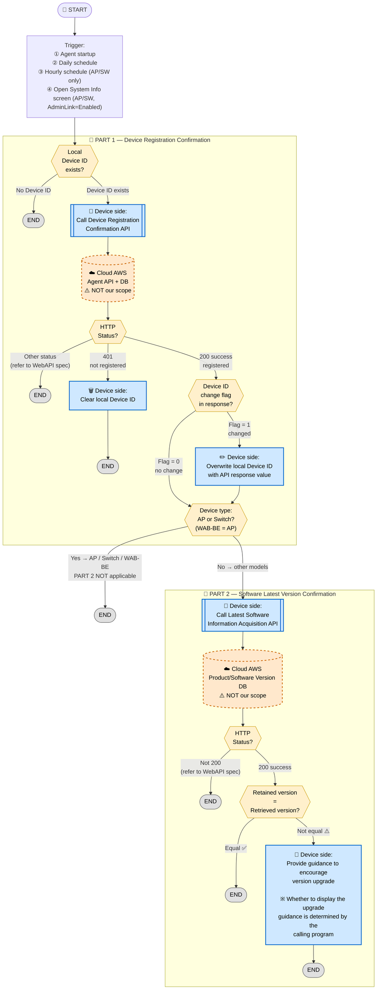
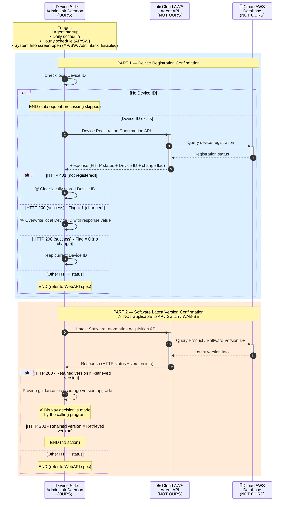

# 1. Device Entry / Software Flow

> **來源 (Source)**: `EJ02.(AdminLink) 01. WebAPI Specification Supplement (Agent_Cloud Linkage Flow) v1.06`
> **Sheet**: `1.Device entry_software flow`
> ⚠️ 衍生摘要 (derived summary)，僅供引述與對照；規格衝突時以 EJ02 spec 英文原文為準。
> 正式需求：[`SPEC_v2_AGT2_Agent.md`](../../current/SPEC_v2_AGT2_Agent.md) · 對照 API SKILL：`/adminlink-confirm-registration`, `/adminlink-software-update`

---

## Scope & Roles

| Side | Component | Owner | Notes |
|---|---|---|---|
| **Device** | AdminLink Daemon (Agent) | **OURS (ELECOM)** — design & implement | Runs on **WAB-BE series** which follows the **AP flow** |
| **Cloud (AWS)** | Agent API + Database | **NOT OURS** — designed by third party | We only call APIs and conform to the WebAPI specification; we do not design or modify cloud behavior |

> ⚠️ **Implementation boundary**: Only the device-side daemon is in our scope. All Cloud (AWS) endpoints, error semantics, and DB behavior are governed by the WebAPI specification document.

> ⚠️ **WAB-BE series rule**: WAB-BE is an AP product. It **must follow the AP flow**:
> - Hourly periodic execution applies
> - Execution when user opens System Information screen (with AdminLink "Enabled") applies
> - **PART 2 (software version confirmation) is NOT applicable**

---

## Execution Timing

This flow is expected to be executed at the following timing (verbatim from spec):

- At startup of the agent
- Daily processing by schedule
- (AP and Switch) Hourly periodical process by schedule
- (AP and Switch) When the user opens the system information screen with AdminLink Function "Enable"

---

## Diagram 1 — Flowchart (Main: Decision Logic)

---

## Diagram 2 — Sequence Diagram (Supplementary: API Interaction)

---

## Key Implementation Notes

### 1. Trigger conditions (verbatim from spec)
- At startup of the agent
- Daily processing by schedule
- (AP and Switch) Hourly periodical process by schedule
- (AP and Switch) When the user opens the system information screen with AdminLink Function "Enable"

### 2. WAB-BE series = AP flow
- Hourly periodic execution **applies**
- System Information screen trigger **applies**
- PART 2 (software version confirmation) **does NOT apply**

### 3. Role boundary (critical for AI / implementers)
- **Device side (OURS — implement here)**: AdminLink daemon
  - Local Device ID storage and lifecycle
  - API invocation
  - HTTP status / response handling
  - Upgrade prompt gating (the calling program decides whether to display)
- **Cloud side (NOT OURS — do not modify)**: AWS Agent API + Database
  - Governed by the WebAPI specification document
  - Conform to it; do not change behavior

### 4. Spec-faithful behavior
All wording inside the diagrams (API names, conditions, actions) is kept verbatim with the original specification. Detailed error processing per status / error ID must reference the WebAPI specification document — this flow is a summary only.

### 5. Display of upgrade guidance
Whether to display the upgrade prompt is **determined by the calling program**, not by this flow. The daemon only provides the guidance trigger.

### 6. Reference implementation
When implementing, refer to the following modules in the IoT Agent Development Sample:
- Device registration confirmation
- Get the latest software information

---

## Quick Reference Table

| API | Direction | When called | Applies to |
|---|---|---|---|
| Device Registration Confirmation API | Device → Cloud | Always (if local Device ID exists) | All models incl. WAB-BE |
| Latest Software Information Acquisition API | Device → Cloud | After PART 1 succeeds | **Excluded** for AP / Switch / WAB-BE |

| HTTP Response | Action |
|---|---|
| `200` + flag=0 | Keep current Device ID, proceed |
| `200` + flag=1 | Overwrite local Device ID, proceed |
| `401` | Clear local Device ID, END |
| Other | END (refer to WebAPI spec for detailed handling) |

---

## Done When

- Agent successfully calls Device Registration Confirmation API at each trigger
- Local Device ID is correctly updated/cleared based on HTTP status and change flag
- For non-AP/Switch models: Software version is checked and upgrade guidance is provided when versions differ
- For WAB-BE / AP / Switch: PART 2 is skipped
- All error cases follow the WebAPI specification document