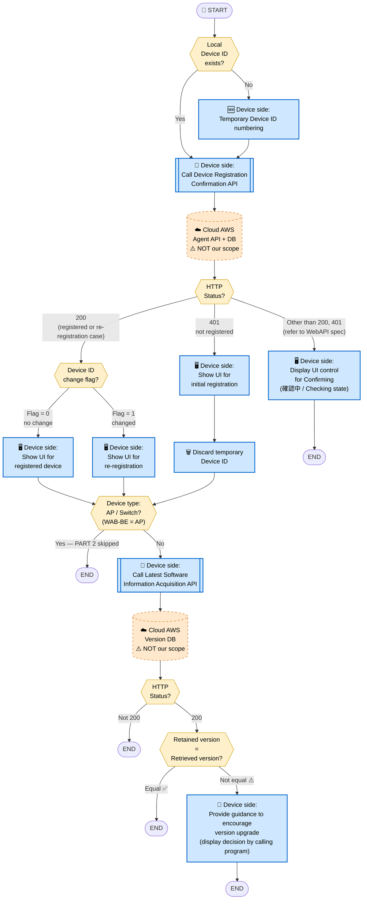
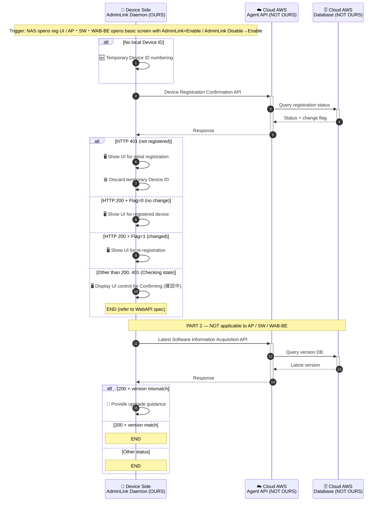

# 2. Device Entry Startup Flow

> **來源 (Source)**: `EJ02.(AdminLink) 01. WebAPI Specification Supplement (Agent_Cloud Linkage Flow) v1.06`
> **Sheet**: `2.Device entry startup flow`
> ⚠️ 衍生摘要 (derived summary)，僅供引述與對照；規格衝突時以 EJ02 spec 英文原文為準。
> 正式需求：[`SPEC_v2_AGT2_Agent.md`](../../current/SPEC_v2_AGT2_Agent.md) · 對照 API SKILL：`/adminlink-confirm-registration`, `/adminlink-software-update`

---

## Scope & Roles

| Side | Component | Owner |
|---|---|---|
| **Device** | AdminLink Daemon | **OURS (ELECOM)** — WAB-BE follows AP flow |
| **Cloud (AWS)** | Agent API + Database | **NOT OURS** — per WebAPI spec |

## Execution Timing

- When NAS opens the device registration UI
- When AP / Switch / **WAB-BE** opens the basic screen with AdminLink = "Enable"
- When AP / Switch / **WAB-BE** changes AdminLink from "Disable" → "Enable"

## Diagram 1 — Flowchart

## Diagram 2 — Sequence Diagram

## Display UI Control for Confirming — Input Field Display Rules

> **來源**: Sheet `2.Device entry startup flow`，列 77–88（【Input items on the device registration screen】/【デバイス登録画面の入力項目】子表）
>
> 此表為 UI 分支決定後的**第二層判斷**：依照進入的是 initial / registered / re-registration 哪一條分支，畫面上的輸入欄位顯示與否會不同。

| # | Item / 項目 | Display Control / 入力項目の表示制御 | Initial Registration | Registered / Re-Registration |
|---|---|---|:---:|:---:|
| 1 | Device registration code デバイス登録コード | Always displayed / 常に表示 | ✅ 顯示 | ✅ 顯示 |
| 2 | Management name 管理名称 | Displayed only when registering for the first time 初回登録時のみ表示 | ✅ 顯示 | ❌ 隱藏 |
| 3 | Product serial number 製品シリアル番号 | Displayed only when registering for the first time 初回登録時のみ表示 | ✅ 顯示 | ❌ 隱藏 |
| 4 | Remote control permission 遠隔操作許可 | Displayed only when registering for the first time 初回登録時のみ表示 | ✅ 顯示 | ❌ 隱藏 |
| 5 | Remarks 備考 | Always displayed / 常に表示 ⚠️ | ✅ 顯示 | ✅ 顯示 |

> ⚠️ **Spec 疑似筆誤**：Sheet 上 `Remarks / 備考` 那格的原文是 `"常に表示初回登録時のみ表示"`（兩串黏在一起，無分隔符）。依欄位語意判斷應為「常に表示 / Always displayed」，但實作前**需回對照 EJ02 spec 原檔並向上游確認正確值**。

## Key Notes
1. **Temporary Device ID**: Numbered locally before calling the API when no Device ID exists. Discarded after the registration UI flow completes (initial registration case).
2. **Three UI branches (第一層判斷)**: initial registration / registered / re-registration — decided by HTTP status + change flag.
3. **Input field display control (第二層判斷)**: UI 分支決定後，依「Display UI Control for Confirming」表決定各欄位顯示與否：
   - **常に表示 (always)**：Device registration code、Remarks
   - **初回登録時のみ表示 (initial only)**：Management name、Product serial number、Remote control permission
   - 即 registered / re-registration UI 須**隱藏** Management name、Product serial number、Remote control permission 這 3 個欄位。
4. **PART 2 not applicable to AP / Switch / WAB-BE**.
5. Detailed error handling per status / error ID → refer to WebAPI specification.

## Done When
- Correct UI (initial / registered / re-registration) is displayed based on API response **(第一層)**
- Within the chosen UI, input fields are shown / hidden per the「Display UI Control for Confirming」table **(第二層)**
- Temporary Device ID is discarded after initial registration UI flow
- For non-AP/SW models, version upgrade guidance is provided when versions differ
- Any discrepancy on `Remarks / 備考` display rule has been cross-checked against EJ02 spec original