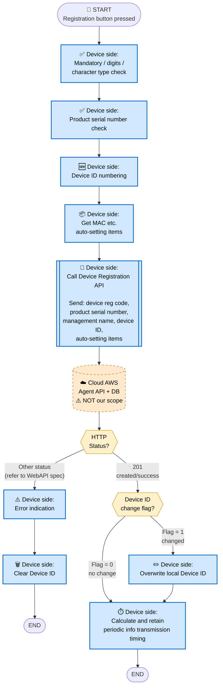
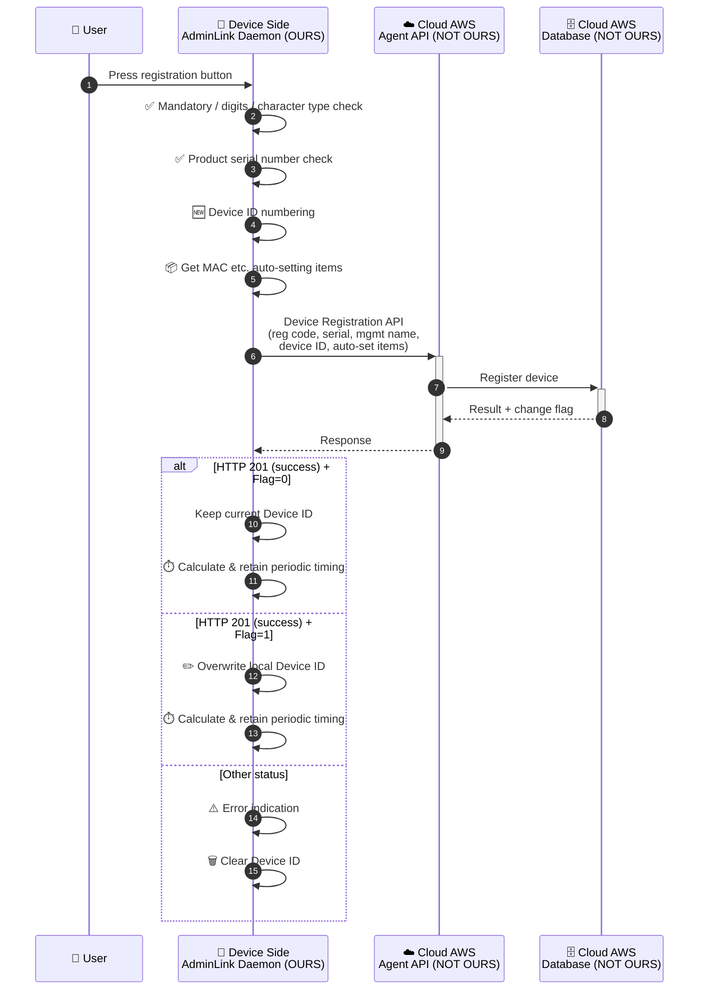

# 3. Device Registration Flow

> **來源 (Source)**: `EJ02.(AdminLink) 01. WebAPI Specification Supplement (Agent_Cloud Linkage Flow) v1.06`
> **Sheet**: `3.Device registration flow`
> ⚠️ 衍生摘要 (derived summary)，僅供引述與對照；規格衝突時以 EJ02 spec 英文原文為準。
> 正式需求：[`SPEC_v2_AGT2_Agent.md`](../../current/SPEC_v2_AGT2_Agent.md) · 對照 API SKILL：`/adminlink-register-device`

---

## Scope & Roles

| Side | Component | Owner |
|---|---|---|
| **Device** | AdminLink Daemon | **OURS (ELECOM)** — WAB-BE follows AP flow |
| **Cloud (AWS)** | Agent API + Database | **NOT OURS** — per WebAPI spec |

## Execution Timing
- When the user presses the **registration button** on the device registration UI
- **Prerequisite**: Flow 2 (Device entry startup) has completed, and required input items are entered

## Diagram 1 — Flowchart

## Diagram 2 — Sequence Diagram

## Key Notes
1. **Pre-API validation**: Mandatory / digits / character type check and product serial number check are performed on the device side before calling the API.
2. **Items sent**: device registration code, product serial number, management name, device ID, auto-setting items (MAC etc.).
3. **Success = HTTP 201** (not 200).
4. **On failure**: error indication + clear Device ID.
5. **On success**: calculate and retain timing for periodic info transmission (used by Flow 6).
6. Detailed error handling per status / error ID → refer to WebAPI specification.

## Done When
- All input checks pass before API call
- Device is registered in cloud DB (HTTP 201)
- Local Device ID is overwritten if change flag = 1
- Periodic transmission timing is calculated and stored for subsequent flows