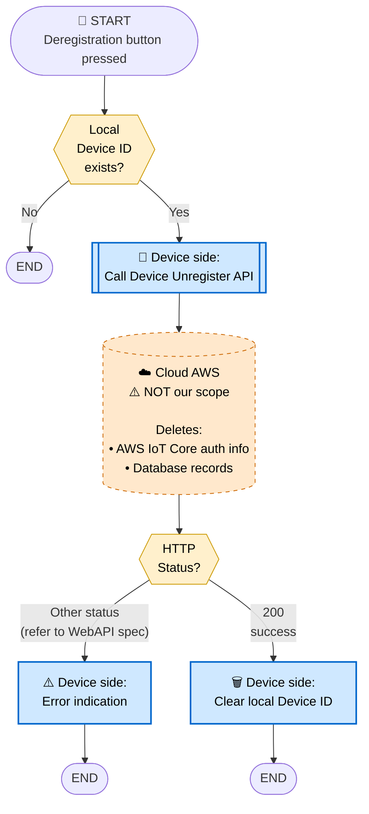
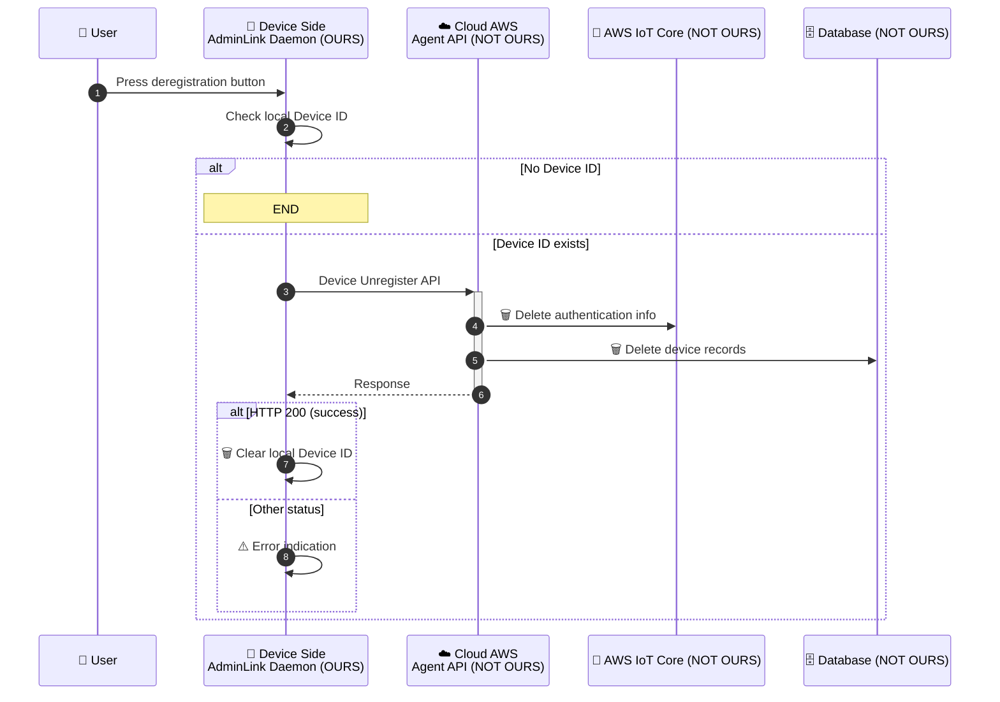

# 4. Device Deregistration Flow

> **來源 (Source)**: `EJ02.(AdminLink) 01. WebAPI Specification Supplement (Agent_Cloud Linkage Flow) v1.06`
> **Sheet**: `4.Device deregistration flow`
> ⚠️ 衍生摘要 (derived summary)，僅供引述與對照；規格衝突時以 EJ02 spec 英文原文為準。
> 正式需求：[`SPEC_v2_AGT2_Agent.md`](../../current/SPEC_v2_AGT2_Agent.md) · 對照 API SKILL：`/adminlink-unregister-device`

---

## Scope & Roles

| Side | Component | Owner |
|---|---|---|
| **Device** | AdminLink Daemon | **OURS (ELECOM)** — WAB-BE follows AP flow |
| **Cloud (AWS)** | Agent API + IoT Core + DB | **NOT OURS** — per WebAPI spec |

## Execution Timing
- When the user presses the **deregistration button**

## Diagram 1 — Flowchart

## Diagram 2 — Sequence Diagram

## Key Notes
1. **Cloud-side cleanup is automatic**: When the Unregister API is called, the cloud deletes both AWS IoT Core authentication info **and** database records. We do not manage this.
2. **Local cleanup is our responsibility**: Clear the local Device ID only on HTTP 200 success.
3. **No local clear on error**: Keep the local Device ID so the user can retry.
4. Detailed error handling per status / error ID → refer to WebAPI specification.

## Done When
- Cloud-side IoT Core auth and DB records are deleted (cloud responsibility)
- Local Device ID is cleared on success
- Error is indicated to user on failure (local Device ID retained for retry)