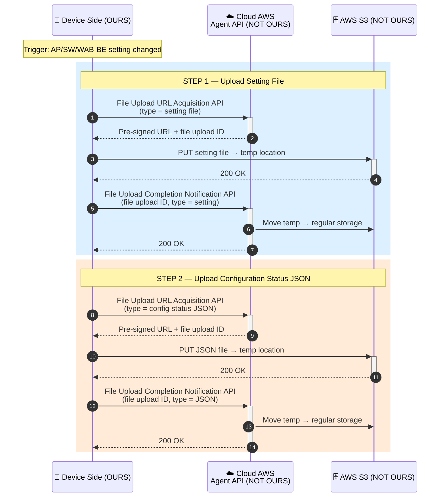

# 5. Change Dev Setting Flow (AP, SW)

> **來源 (Source)**: `EJ02.(AdminLink) 01. WebAPI Specification Supplement (Agent_Cloud Linkage Flow) v1.06`
> **Sheet**: `5.Chang Dev Setting flow(AP,SW)`
> **適用 (Applies to)**: AP / Switch / **WAB-BE**（follows AP flow）
> ⚠️ 衍生摘要 (derived summary)，僅供引述與對照；規格衝突時以 EJ02 spec 英文原文為準。
> 正式需求：[`SPEC_v2_AGT2_Agent.md`](../../current/SPEC_v2_AGT2_Agent.md) · 對照 API SKILL：`/adminlink-upload-url`, `/adminlink-upload-notify`

---

## Scope & Roles

| Side | Component | Owner |
|---|---|---|
| **Device** | AdminLink Daemon | **OURS (ELECOM)** |
| **Cloud (AWS)** | Agent API + S3 + DB | **NOT OURS** — per WebAPI spec |

## Execution Timing
- When changing network device (AP / Switch / WAB-BE) settings

## Diagram 1 — Flowchart

```mermaid
flowchart TD
    Start([🚀 START<br/>Setting change occurred])
    Start --> Check{{"Local<br/>Device ID<br/>exists?"}}
    Check -->|"No"| EndA([END])
    Check -->|"Yes"| GetURL1

    subgraph SettingFile["📄 STEP 1 — Setting File"]
        GetURL1[["📡 Device side:<br/>Call File Upload URL<br/>Acquisition API<br/>(type = setting file)"]]
        Cloud1[("☁️ Cloud AWS<br/>Returns S3 pre-signed URL<br/>+ file upload ID")]
        PUT1["⬆️ Device side:<br/>HTTP PUT setting file<br/>to S3 temp location"]
        Notify1[["📡 Device side:<br/>Call File Upload Completion<br/>Notification API<br/>(file upload ID, type=setting)"]]
        Move1[("☁️ Cloud AWS:<br/>Move file from temp<br/>to regular storage")]

        GetURL1 --> Cloud1
        Cloud1 --> PUT1
        PUT1 --> S3_1[("☁️ AWS S3<br/>temp location")]
        S3_1 --> Notify1
        Notify1 --> Move1
    end

    Move1 --> GetURL2

    subgraph StatusJSON["📊 STEP 2 — Configuration Status JSON"]
        GetURL2[["📡 Device side:<br/>Call File Upload URL<br/>Acquisition API<br/>(type = config status JSON)"]]
        Cloud2[("☁️ Cloud AWS<br/>Returns S3 pre-signed URL<br/>+ file upload ID")]
        PUT2["⬆️ Device side:<br/>HTTP PUT JSON file<br/>to S3 temp location"]
        Notify2[["📡 Device side:<br/>Call File Upload Completion<br/>Notification API<br/>(file upload ID, type=JSON)"]]
        Move2[("☁️ Cloud AWS:<br/>Move file from temp<br/>to regular storage")]

        GetURL2 --> Cloud2
        Cloud2 --> PUT2
        PUT2 --> S3_2[("☁️ AWS S3<br/>temp location")]
        S3_2 --> Notify2
        Notify2 --> Move2
    end

    Move2 --> EndB([END])

    classDef deviceSide fill:#cfe8ff,stroke:#0066cc,stroke-width:2px,color:#000
    classDef cloudSide fill:#ffe8cc,stroke:#cc6600,stroke-dasharray: 5 5,color:#000
    classDef decision fill:#fff0cc,stroke:#cc9900,color:#000

    class GetURL1,PUT1,Notify1,GetURL2,PUT2,Notify2 deviceSide
    class Cloud1,Move1,S3_1,Cloud2,Move2,S3_2 cloudSide
    class Check decision
```

## Diagram 2 — Sequence Diagram

## Key Notes
1. **Two-file upload**: setting file + configuration status JSON are uploaded sequentially.
2. **S3 pre-signed URL pattern**: Each upload has 3 steps — get URL, PUT to S3, notify completion. This is the standard pattern reused by Flow 8.
3. **Temp → regular**: Cloud moves files from temp to regular storage only after completion notification.
4. **Use Flow 8 (File upload flow)** for the underlying upload mechanics.

## Done When
- Setting file is uploaded and confirmed via completion notification
- Configuration status JSON is uploaded and confirmed via completion notification
- Cloud has moved both files from temp to regular storage