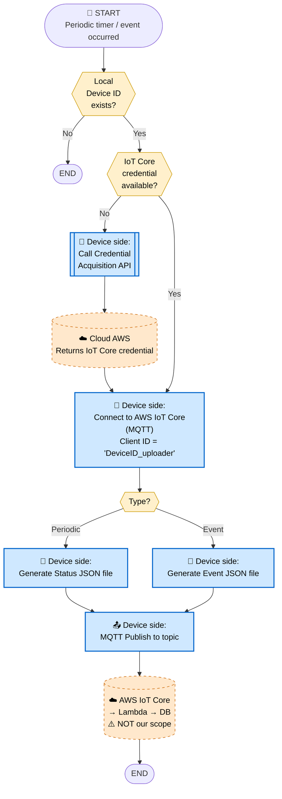
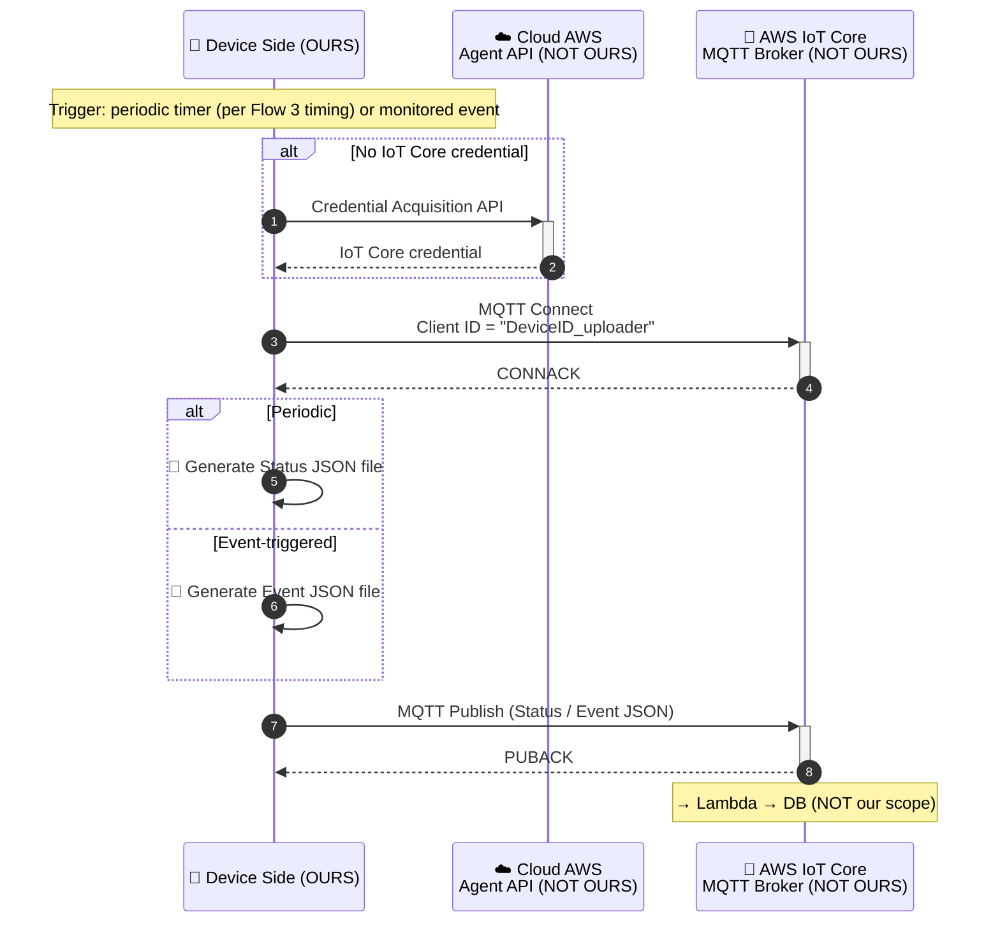

# 6. Status / Event Upload Flow

> **來源 (Source)**: `EJ02.(AdminLink) 01. WebAPI Specification Supplement (Agent_Cloud Linkage Flow) v1.06`
> **Sheet**: `6.Status_event upload flow`
> ⚠️ 衍生摘要 (derived summary)，僅供引述與對照；規格衝突時以 EJ02 spec 英文原文為準。
> 正式需求：[`SPEC_v2_AGT2_Agent.md`](../../current/SPEC_v2_AGT2_Agent.md) · 對照 API SKILL：`/adminlink-auth-info`

---

## Scope & Roles

| Side | Component | Owner |
|---|---|---|
| **Device** | AdminLink Daemon | **OURS (ELECOM)** — WAB-BE follows AP flow |
| **Cloud (AWS)** | IoT Core (MQTT) + Lambda + DB | **NOT OURS** — per WebAPI spec |

## Execution Timing
- **Periodic**: per timing calculated in Flow 3 (after device registration)
- **Event-triggered**: when monitored events occur (status change, etc.)

## Diagram 1 — Flowchart

## Diagram 2 — Sequence Diagram

## Key Notes
1. **⚠️ Client ID uniqueness**: Use `DeviceID_uploader` — must **differ** from Flow 7's `DeviceID_remoteCtrl`. Same Device ID with different suffixes allows two parallel MQTT connections (upload + remote control reception).
2. **Credential caching**: Only call Credential Acquisition API when no credential is available locally.
3. **Two file types**: Status JSON (periodic) and Event JSON (event-triggered) — both use the same MQTT publish path.
4. **Periodic timing** comes from Flow 3 calculation.

## Done When
- MQTT connection to IoT Core is established with the `_uploader` client ID
- Status / Event JSON file is generated and published successfully
- PUBACK received from broker
