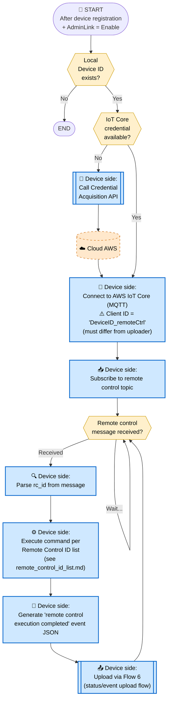
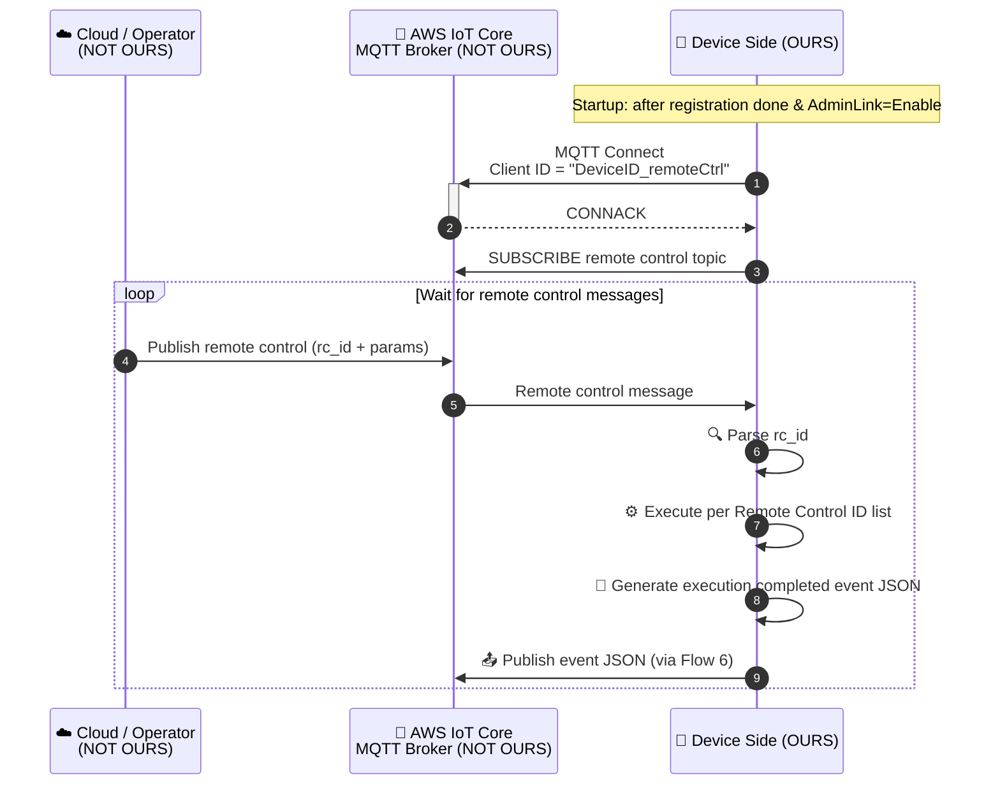

# 7. Remote Control Reception Flow

> **來源 (Source)**: `EJ02.(AdminLink) 01. WebAPI Specification Supplement (Agent_Cloud Linkage Flow) v1.06`
> **Sheet**: `7.Remote control reception flow`
> **Related**: `remote_control_id_list.md`（command catalog）
> ⚠️ 衍生摘要 (derived summary)，僅供引述與對照；規格衝突時以 EJ02 spec 英文原文為準。
> 正式需求：[`SPEC_v2_AGT3_RemoteControl.md`](../../current/SPEC_v2_AGT3_RemoteControl.md) · 對照 API SKILL：`/adminlink-auth-info`

---

## Scope & Roles

| Side | Component | Owner |
|---|---|---|
| **Device** | AdminLink Daemon | **OURS (ELECOM)** — WAB-BE follows AP flow |
| **Cloud (AWS)** | IoT Core (MQTT) + Lambda | **NOT OURS** — per WebAPI spec |

## Execution Timing
- After device registration is completed (Flow 3)
- AdminLink Function = "Enable"
- **Runs continuously** — subscribes and waits for messages

## Diagram 1 — Flowchart

## Diagram 2 — Sequence Diagram

## Key Notes
1. **⚠️ Client ID uniqueness**: Use `DeviceID_remoteCtrl` — must **differ** from Flow 6's `DeviceID_uploader`. AWS IoT Core rejects duplicate client IDs (causes disconnection).
2. **Continuous loop**: Subscribe once at startup, then loop forever processing incoming messages.
3. **Execution reporting**: Every executed command must generate a completion event JSON and upload via Flow 6.
4. **Command catalog**: See `remote_control_id_list.md` for the full list of rc_id values and applicable device types.
5. **File operations**: rc_id 2010 uses Flow 9 (download); rc_id 4010/4020/4030/4040 use Flow 8 (upload).

## Done When
- Persistent MQTT connection established with `_remoteCtrl` client ID
- Subscribed to remote control topic
- Each received command is executed per Remote Control ID list
- Each execution generates and publishes a completion event JSON