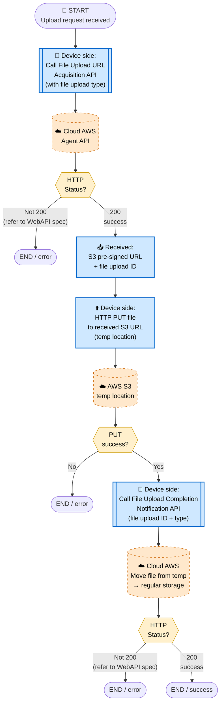
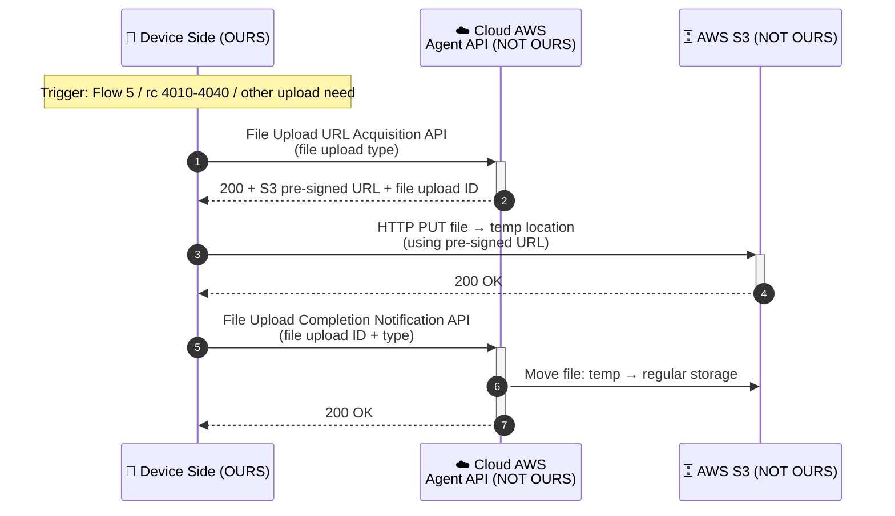

# 8. File Upload Flow

> **來源 (Source)**: `EJ02.(AdminLink) 01. WebAPI Specification Supplement (Agent_Cloud Linkage Flow) v1.06`
> **Sheet**: `8.File upload flow`
> **Used by**: Flow 5（setting file upload）· Remote control 4010/4020/4030/4040
> ⚠️ 衍生摘要 (derived summary)，僅供引述與對照；規格衝突時以 EJ02 spec 英文原文為準。
> 正式需求：[`SPEC_v2_AGT2_Agent.md`](../../current/SPEC_v2_AGT2_Agent.md) · 對照 API SKILL：`/adminlink-upload-url`, `/adminlink-upload-notify`

---

## Scope & Roles

| Side | Component | Owner |
|---|---|---|
| **Device** | AdminLink Daemon | **OURS (ELECOM)** |
| **Cloud (AWS)** | Agent API + S3 | **NOT OURS** — per WebAPI spec |

## Execution Timing
- **From Flow 5**: setting file upload, configuration status JSON upload
- **From Flow 7 remote control**:
  - 4010 — Upload debug log
  - 4020 — Upload log
  - 4030 — Upload configuration file
  - 4040 — Upload connection client file
- Any other upload need

## Diagram 1 — Flowchart

## Diagram 2 — Sequence Diagram

## Key Notes
1. **3-step pattern**: get URL → PUT to S3 → notify completion. All three are required.
2. **File upload type** must be specified — determines destination and post-processing on cloud side.
3. **Temp → regular** move happens only after completion notification. If you skip the notification, the file is orphaned.
4. **Reusable**: This flow is called by Flow 5 and by remote control commands 4010/4020/4030/4040.
5. Detailed error handling per status / error ID → refer to WebAPI specification.

## Done When
- Pre-signed URL acquired
- File successfully PUT to S3 temp location
- Completion notification sent and acknowledged
- Cloud has moved the file to regular storage