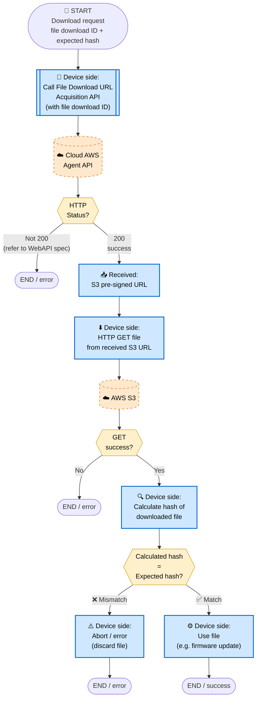
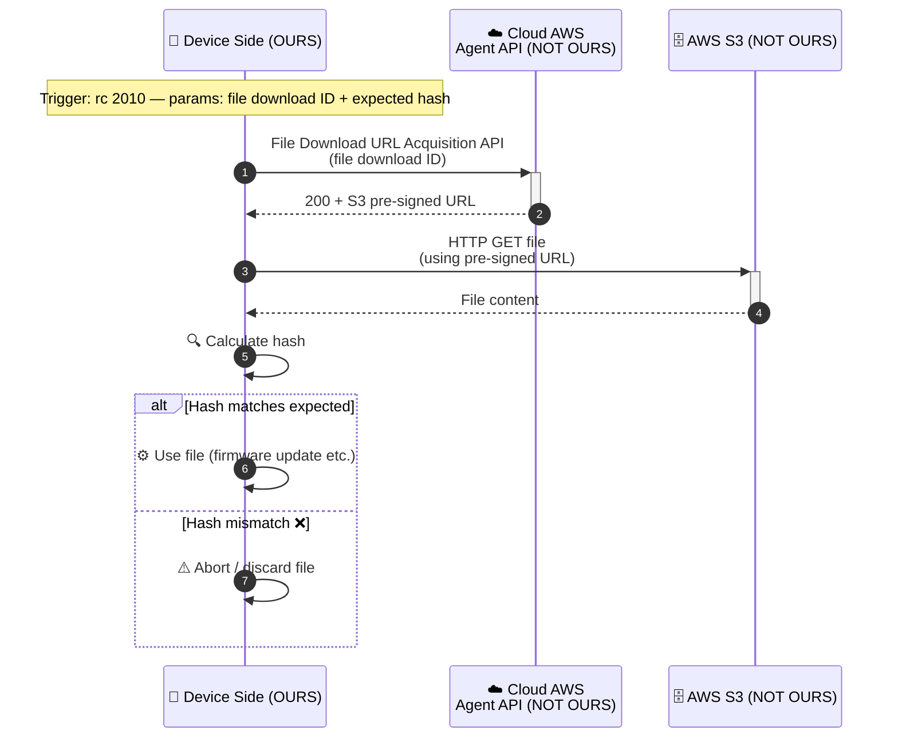

# 9. File Download Flow

> **來源 (Source)**: `EJ02.(AdminLink) 01. WebAPI Specification Supplement (Agent_Cloud Linkage Flow) v1.06`
> **Sheet**: `9.File download flow`
> **Used by**: Remote control 2010（firmware update）
> ⚠️ 衍生摘要 (derived summary)，僅供引述與對照；規格衝突時以 EJ02 spec 英文原文為準。
> 正式需求：[`SPEC_v2_AGT2_Agent.md`](../../current/SPEC_v2_AGT2_Agent.md) · 對照 API SKILL：`/adminlink-download-url`, `/adminlink-download-notify`

---

## Scope & Roles

| Side | Component | Owner |
|---|---|---|
| **Device** | AdminLink Daemon | **OURS (ELECOM)** |
| **Cloud (AWS)** | Agent API + S3 | **NOT OURS** — per WebAPI spec |

## Execution Timing
- **From Flow 7 remote control**:
  - 2010 — Firmware update (params: file download ID + expected hash)

## Diagram 1 — Flowchart

## Diagram 2 — Sequence Diagram

## Key Notes
1. **2-step pattern**: get URL → GET from S3. No completion notification (unlike upload).
2. **⚠️ Hash verification is mandatory**: Always verify the downloaded file's hash against the expected hash received with the command. Mismatch = abort.
3. **Primary use case**: Firmware update via remote control 2010.
4. **No notification back to cloud**: The cloud already knows what file it served. Completion is reported via the Flow 7 execution completed event.
5. Detailed error handling per status / error ID → refer to WebAPI specification.

## Done When
- Pre-signed URL acquired
- File successfully downloaded from S3
- Hash verified to match expected value
- File used (e.g. firmware update applied) only after hash match
