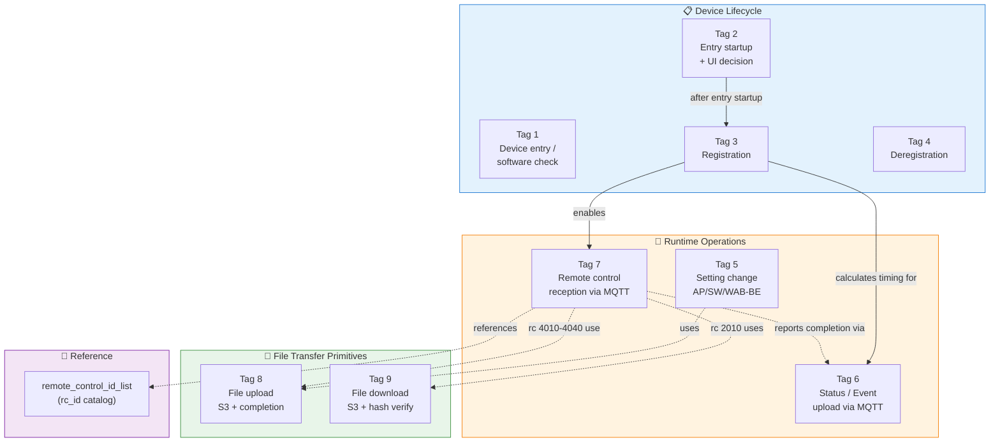
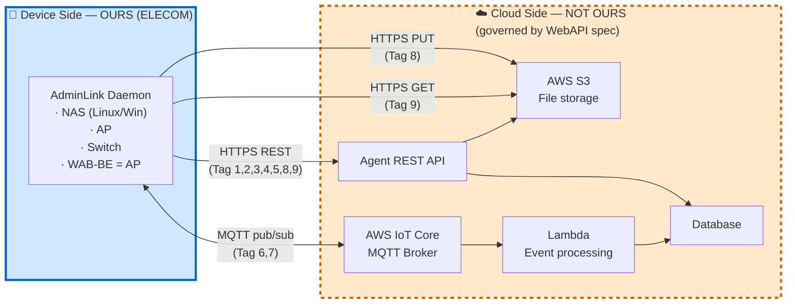

# 🗂️ ELECOM AdminLink Daemon — Cloud Linkage Flow Index

> **來源 (Source)**: `EJ02.(AdminLink) 01. WebAPI Specification Supplement (Agent_Cloud Linkage Flow) v1.06`
> 對應 workbook：`EJ100_AdminLinkRequestSpecifications_APSW_v2.00Draft_20251111.xlsx`
> **Scope**: Device-side AdminLink daemon (OURS). Cloud (AWS) side is governed by the WebAPI specification (NOT OURS).
> **Applies to**: NAS (Linux/Windows), AP, Switch, **WAB-BE series (follows AP flow)**
> ⚠️ 衍生摘要 (derived summary)，僅供引述與對照；規格衝突時以 EJ02 spec 英文原文為準。正式需求見 [`../../current/`](../../current/)。

---

## 📚 Skill Files in This Pack

| Tag | File name | Topic |
|:-:|---|---|
| **1** | `01_device_entry_software_flow.md` | Device entry + software version check (periodic) |
| **2** | `02_device_entry_startup_flow.md` | Entry startup — decide which registration UI to show |
| **3** | `03_device_registration_flow.md` | Device registration (press registration button) |
| **4** | `04_device_deregistration_flow.md` | Device deregistration (press deregistration button) |
| **5** | `05_change_dev_setting_flow.md` | Change AP/SW/WAB-BE settings — upload setting file + status JSON |
| **6** | `06_status_event_upload_flow.md` | Periodic / event upload via AWS IoT Core MQTT |
| **7** | `07_remote_control_reception_flow.md` | Remote control reception via MQTT subscription |
| **8** | `08_file_upload_flow.md` | File upload — S3 pre-signed URL pattern |
| **9** | `09_file_download_flow.md` | File download — S3 pre-signed URL + hash verify |
| **📖** | `remote_control_id_list.md` | rc_id catalog with device-type applicability |

---

## 🚦 How to Use This Index

When implementing or answering questions about the AdminLink daemon:

1. **Identify the trigger / intent** from the user's request
2. **Match it to a flow** using the routing table below → note the **tag number**
3. **Read the matching skill file** (`<tag>-*.md`) for the detailed flowchart + sequence diagram
4. **Check cross-flow dependencies** — many flows call into Flow **6**, **8**, or **9**

---

## 🎯 Intent Routing Table

| If user asks about... | Use skill | Tag |
|---|---|:-:|
| "AdminLink startup", "check device ID", "agent boot", "daily/hourly periodic check" | `01_device_entry_software_flow.md` | **1** |
| "open registration UI", "NAS opens registration", "AdminLink Disable→Enable", "initial / registered / re-registration UI" | `02_device_entry_startup_flow.md` | **2** |
| "press registration button", "register device", "input validation + Device ID numbering" | `03_device_registration_flow.md` | **3** |
| "deregister", "unregister", "press deregistration button", "delete IoT Core auth" | `04_device_deregistration_flow.md` | **4** |
| "change AP/SW/WAB-BE settings", "upload setting file", "upload config status JSON" | `05_change_dev_setting_flow.md` | **5** |
| "periodic status upload", "event upload", "MQTT publish status JSON", "DeviceID_uploader" | `06_status_event_upload_flow.md` | **6** |
| "remote control", "rc_id", "MQTT subscribe", "DeviceID_remoteCtrl", "execute remote command" | `07_remote_control_reception_flow.md` | **7** |
| "S3 upload", "file upload URL", "PUT file to S3", "upload log / config / connection client" | `08_file_upload_flow.md` | **8** |
| "firmware download", "S3 download", "hash verification", "file download URL" | `09_file_download_flow.md` | **9** |
| "what does rc_id 2010/4010/5050 do?", "which devices support [command]?", "remote control parameters" | `remote_control_id_list.md` | 📖 |

---

## 📊 Complete Flow Map

---

## 🏛️ Architecture — Who Owns What

---

## 🔑 Critical Implementation Rules

### Rule 1 — WAB-BE = AP
**WAB-BE series follows the AP flow in every flow.** Whenever a flow says "applicable to AP / Switch", read it as "AP / Switch / WAB-BE". Whenever a flow says "NOT applicable to AP / Switch", WAB-BE is also excluded.

### Rule 2 — Role Boundary
- **OURS**: AdminLink daemon (device side). Implement here.
- **NOT OURS**: Cloud (AWS) — Agent API, IoT Core, S3, DB, Lambda. We conform to the WebAPI spec; we do not design or modify cloud behavior.

### Rule 3 — MQTT Client ID Uniqueness
Two parallel MQTT connections are required and they **must use different client IDs**:
- **Tag 6** (upload): `DeviceID_uploader`
- **Tag 7** (remote control reception): `DeviceID_remoteCtrl`

Duplicate client IDs cause AWS IoT Core to disconnect.

### Rule 4 — File Transfer Pattern
- **Upload (Tag 8)**: **3 steps** — get URL → PUT to S3 → notify completion. All required.
- **Download (Tag 9)**: **2 steps** — get URL → GET from S3. Then **mandatory hash verification**.

### Rule 5 — Spec Authority
Detailed error processing per HTTP status / error ID is governed by the **WebAPI specification document**. These skill files summarize the flow; refer to the spec for error-level detail.

### Rule 6 — Remote Control Reporting
Every executed remote control command (Tag 7) must generate a "remote control execution completed" event JSON and publish via Tag 6.

---

## 📦 Flow Quick Reference

| Tag | Trigger | API / Channel | Cloud touches |
|:-:|---|---|---|
| **1** | Startup / daily / hourly (AP/SW/WAB-BE) / system info screen (AP/SW/WAB-BE) | REST | DB |
| **2** | Open registration UI / AdminLink enabled | REST | DB |
| **3** | Press registration button | REST | DB, IoT Core (auth) |
| **4** | Press deregistration button | REST | DB, IoT Core (auth) |
| **5** | Setting change (AP/SW/WAB-BE) | REST → uses Tag 8 | S3, DB |
| **6** | Periodic timer / event | MQTT publish | IoT Core → Lambda → DB |
| **7** | After registration + AdminLink Enable | MQTT subscribe | IoT Core (continuous) |
| **8** | Called by Tag 5 / rc 4010-4040 | REST + HTTPS PUT | S3, DB |
| **9** | Called by rc 2010 | REST + HTTPS GET | S3 |

---

## 🛠️ Implementation Reference

When implementing, refer to the IoT Agent Development Sample modules:

| Module | Used by Tag |
|---|:-:|
| Device registration confirmation | 1, 2 |
| Get the latest software information | 1, 2 |
| Device registration | 3 |
| Device unregister | 4 |
| File upload URL acquisition + completion notification | 5, 8 |
| Credential acquisition | 6, 7 |
| IoT Core MQTT connect / publish | 6, 7 |
| File download URL acquisition | 9 |

---

## ✅ Reading Order for New Implementers

1. **INDEX.md** (this file) — understand the landscape
2. **Tags 1, 2, 3, 4** — device lifecycle (must work first)
3. **Tag 6** — status upload (uses periodic timing from Tag 3)
4. **Tag 7** + **remote_control_id_list.md** — remote control reception
5. **Tags 8, 9** — file transfer primitives (called by Tag 5 / Tag 7)
6. **Tag 5** — setting change (combines lifecycle + Tag 8)

---

## 🔗 Cross-Reference Cheat Sheet

| If you're reading... | You'll need... |
|---|---|
| Tag 2 (entry startup) | Tag 1 (shared device-ID logic) |
| Tag 3 (registration) | Tag 2 (prerequisite), Tag 6 (calculates its timing) |
| Tag 5 (setting change) | Tag 8 (file upload mechanism) |
| Tag 6 (status/event upload) | Tag 3 (timing source) |
| Tag 7 (remote control) | `remote_control_id_list.md` (rc_id meanings), Tag 8 (rc 4xxx), Tag 9 (rc 2010), Tag 6 (completion reporting) |
| `remote_control_id_list.md` | Tag 7 (how commands are received), Tag 8 / Tag 9 (how files move) |