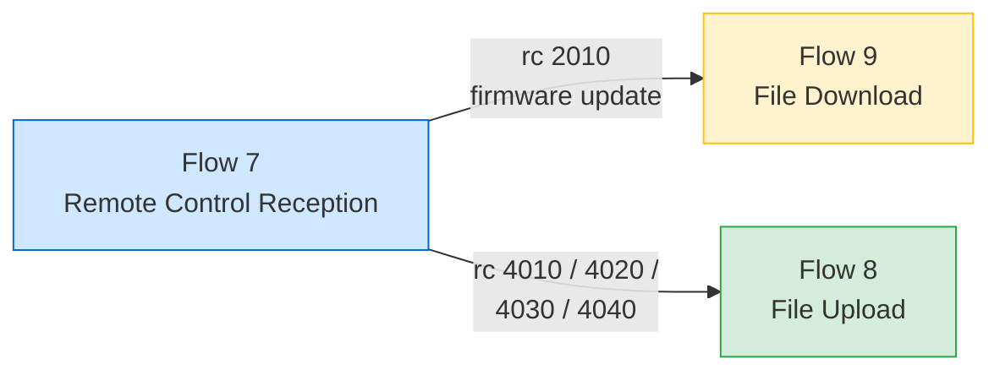

# Remote Control ID List

> **來源 (Source)**: `EJ02.(AdminLink) 01. WebAPI Specification Supplement (Agent_Cloud Linkage Flow) v1.06`
> **Sheet**: `Remote control ID list`
> **Used by**: Flow 7（remote control reception flow）
> ⚠️ 衍生摘要 (derived summary)，僅供引述與對照；規格衝突時以 EJ02 spec 英文原文為準。
> 正式需求：[`SPEC_v2_AGT3_RemoteControl.md`](../../current/SPEC_v2_AGT3_RemoteControl.md) · rc 觸發檔案流：`/adminlink-download-url`, `/adminlink-upload-url`

---

## Device Type Legend

| Symbol | Device Type |
|---|---|
| NAS-L | NAS Linux-based |
| NAS-W | NAS Windows-based |
| AP | Wireless Access Point |
| SW | Switch (PoE) |
| **WAB-BE** | Follows **AP** rules |

## Command Catalog

### Series 1xxx — Power Control

| rc_id | Command | NAS-L | NAS-W | AP | SW | WAB-BE | Parameters | Notes |
|---|---|:-:|:-:|:-:|:-:|:-:|---|---|
| **1010** | Reboot | ✅ | ✅ | ✅ | ✅ | ✅ | — | All models |
| **1020** | Shutdown | ✅ | ✅ | ❌ | ❌ | ❌ | — | NAS only |

### Series 2xxx — Updates

| rc_id | Command | NAS-L | NAS-W | AP | SW | WAB-BE | Parameters | Notes |
|---|---|:-:|:-:|:-:|:-:|:-:|---|---|
| **2010** | Firmware update | ✅ | ❌ | ✅ | ✅ | ✅ | file download ID, expected hash | **Uses Flow 9** (download + hash verify) |
| **2020** | Windows update install | ❌ | ✅ | ❌ | ❌ | ❌ | — | Windows NAS only |

### Series 3xxx — Status / Liveness

| rc_id | Command | NAS-L | NAS-W | AP | SW | WAB-BE | Parameters | Notes |
|---|---|:-:|:-:|:-:|:-:|:-:|---|---|
| **3010** | I'm here (heartbeat ack) | ✅ | ✅ | ✅ | ✅ | ✅ | — | All models |
| **3020** | Restart PoE port | ❌ | ❌ | ❌ | ✅ | ❌ | port number | Switch only |
| **3030** | Status update | ✅ | ✅ | ✅ | ✅ | ✅ | — | All models — trigger immediate status upload |

### Series 4xxx — File Upload

All Series 4xxx commands trigger **Flow 8 (File upload flow)**.

| rc_id | Command | NAS-L | NAS-W | AP | SW | WAB-BE | Parameters | Notes |
|---|---|:-:|:-:|:-:|:-:|:-:|---|---|
| **4010** | Upload debug log | ✅ | ✅ | ✅ | ✅ | ✅ | — | Collect + upload debug log |
| **4020** | Upload log | ✅ | ✅ | ✅ | ✅ | ✅ | — | Collect + upload log |
| **4030** | Upload configuration file | ✅ | ❌ | ✅ | ✅ | ✅ | — | Linux NAS / AP / SW / WAB-BE |
| **4040** | Upload connection client file | ❌ | ❌ | ✅ | ✅ | ✅ | — | AP / SW / WAB-BE only |

### Series 5xxx — Setting Changes

All Series 5xxx commands change local settings. Parameter `setting value`: `1 = Enable`, `2 = Disable`.

| rc_id | Setting | NAS-L | NAS-W | AP | SW | WAB-BE | Parameters |
|---|---|:-:|:-:|:-:|:-:|:-:|---|
| **5010** | Remote control permission | ✅ | ✅ | ✅ | ✅ | ✅ | setting value (1/2) |
| **5020** | File upload allow | ✅ | ✅ | ✅ | ✅ | ✅ | setting value (1/2) |
| **5030** | Auto-upload — debug log | ✅ | ✅ | ✅ | ✅ | ✅ | setting value (1/2) |
| **5040** | Auto-upload — log | ✅ | ✅ | ✅ | ✅ | ✅ | setting value (1/2) |
| **5050** | Auto-upload interval | ✅ | ✅ | ✅ | ✅ | ✅ | interval value |

## Cross-Flow Dependencies

## Key Notes
1. **WAB-BE rule**: Always follows AP applicability.
2. **Every executed command** must generate a "remote control execution completed" event JSON and upload via Flow 6 (see Flow 7).
3. **2010 firmware update**: Must verify hash before applying (see Flow 9).
4. **5050 interval**: changes the periodic timing used by Flow 6 — recalculate after applying.
5. Detailed parameter format / error codes → refer to WebAPI specification.

## Done When
- Command handler maps every rc_id to the correct device-type applicability check
- Unsupported (device, rc_id) pairs are rejected with an error event
- 2010 invokes Flow 9, 4010-4040 invoke Flow 8
- All other commands generate completion event JSON via Flow 6
